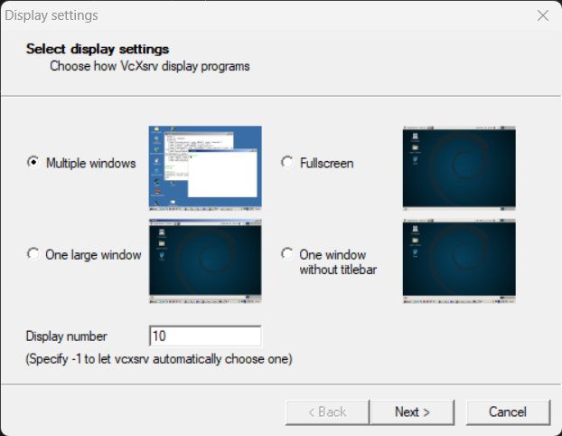
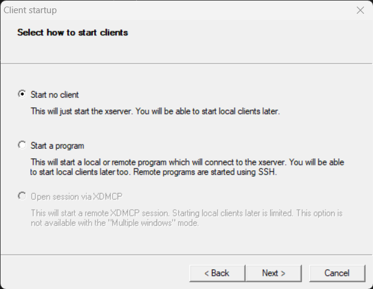
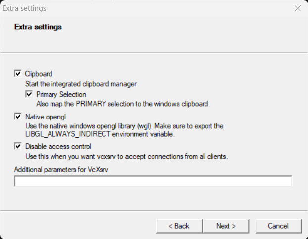
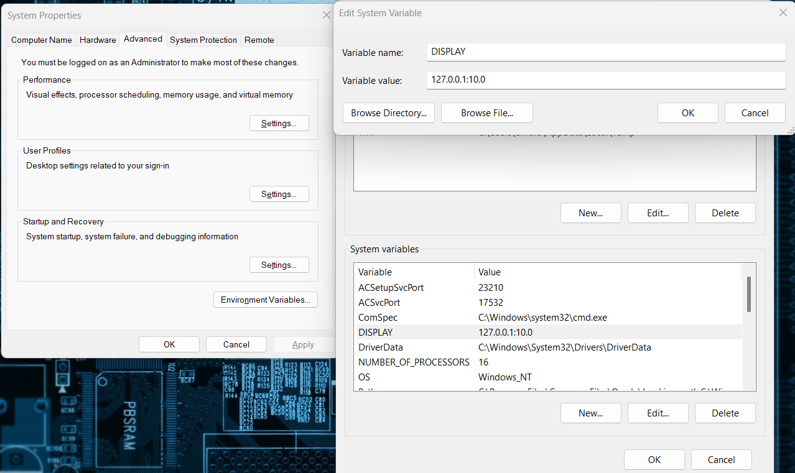

# X11 Forwarding Setup for Display on Host Machine

## Host Machine (Windows)
1. **Download and setup VcXsrv**
   - Go to [VcXsrv GitHub Releases](https://github.com/ArcticaProject/vcxsrv/releases) and download the latest release.

2. **Open XLaunch from Desktop**
   - Follow the XLaunch setup wizard:
     - Step 1: Multiple Windows
     - 
     - Step 2: Start no client
     - 
     - Step 3: Select "Disable Access Control"
     - 


3. **Set Environment Variables**
   - Open Environment Variables on your Windows machine.
   - Add a new environment variable:
     ```
     DISPLAY=127.0.0.1:0.0
     ```
   - 

4. **Configure VS Code**
   - Open **VS Code** and press `F1`.
   - Search and open `Preferences: Open Settings (UI)`.
   - Search for `terminal.integrated.env.windows`.
   - Click **Edit** in `settings.json`.
   - Modify `terminal.integrated.env.windows` to:
     ```json
     "terminal.integrated.env.windows": {
         "DISPLAY": "127.0.0.1:0.0"
     }
     ```

5. **Install Remote SSH Plugin**
   - In VS Code, install the **Remote - SSH** plugin.

6. **Add New SSH Host**
   - Press `Ctrl+Shift+P` and select `Remote-SSH: Add New SSH Host`.
   - Example command:
     ```bash
     ssh -Y pi@<pi_address>
     ```

7. **Modify SSH Configuration in VS Code**
   - Press `F1` and search for `Remote-SSH: Open SSH Configuration File...`.
   - Modify your Raspberry Pi connection:
     ```bash
     Host <YOUR_CONNECTION_NAME>
     HostName <YOUR_PI_IP>
     User <YOUR_PI_USERNAME>
     ForwardAgent yes
     ForwardX11 yes
     ForwardX11Trusted yes
     ```

8. **Connect and Test X11 Forwarding**
   - Connect to your Pi, enter the password (if required), and open the terminal.
   - Test the connection:
     ```bash
     echo $DISPLAY
     ```
   - The result should be :
     ```bash
	 pi@pi:~ $ echo $DISPLAY
	 localhost:10.0
     ```
   - To verify X11 forwarding, run one of the following commands:
     ```bash
     xclock
     xeyes
     chromium-browser
     ```
